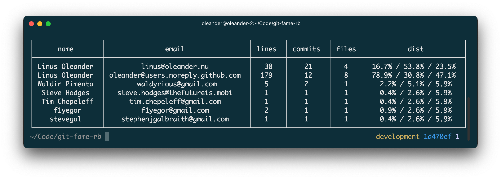

# git-fame [](https://github.com/oleander/git-fame-rb/actions/workflows/main.yml) [](https://rubygems.org/gems/git_fame)



`git-fame` is a command-line tool that helps you summarize and pretty-print collaborators, based on the number of contributions.

The statistics are mostly based on the output of `git blame` on the current branch.
`git fame` counts the total number of current lines of code (and files) that were last touched by each author, and prints out these totals, along with the number of commits per author, as a sorted table.

## Installation

`gem install git_fame`

## Usage

``` shell
Usage: git fame [OPTIONS] [PATH]

GitFame is a tool to generate a contributor list from git history

Arguments:
  PATH  Path or sub path to the git repository

Options:
  -A, --after [DATE]       Only changes made before this date
  -B, --before [DATE]      Only changes made after this date
      --branch [NAME]      Branch to be used as starting point (default
                           "HEAD")
  -E, --exclude [GLOB]     Exclude files matching the given glob pattern
  -e, --extensions [EXT]   File extensions to be included starting with a
                           period
  -h, --help               Print usage
  -I, --include [GLOB]     Include files matching the given glob pattern
      --log-level [LEVEL]  Log level (permitted: debug,info,warn,error,fatal)

Examples:
  Include commits made since 2010
  git fame --after 2010-01-01

  Include commits made before 2015
  git fame --before 2015-01-01

  Include commits made since 2010 and before 2015
  git fame --after 2010-01-01 --before 2015-01-01

  Only changes made to the main branch
  git fame --branch main

  Only ruby and javascript files
  git fame --extensions .rb .js

  Exclude spec files and the README
  git fame --exclude */**/*_spec.rb README.md

  Only spec files and markdown files
  git fame --include */**/*_spec.rb */**/*.md

  A parent directory of the current directory
  git fame ../other/git/repo
```

## Development

1. `git clone https://github.com/oleander/git-fame-rb.git`
2. `bundle install`
3. `bundle exec rspec`
